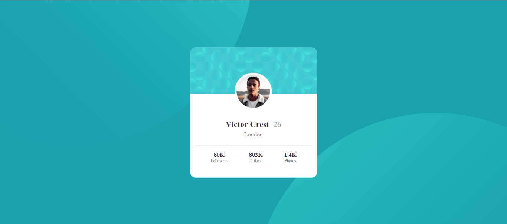

# Frontend Mentor - Profile card component solution

This is a solution to the [Profile card component challenge on Frontend Mentor](https://www.frontendmentor.io/challenges/profile-card-component-cfArpWshJ). Frontend Mentor challenges help you improve your coding skills by building realistic projects. 

## Table of contents

- [Overview](#overview)
  - [The challenge](#the-challenge)
  - [Screenshot](#screenshot)
  - [Links](#links)
- [Author](#author)

## Overview

### The challenge

- Build out the project to the designs provided

### Screenshot

### Links

- Solution URL: [Click me](https://your-solution-url.com)
- Live Site URL: [Click me](https://arjuno-008.github.io/profile-card-component-main-Frontend-Mentor/)

## Author

- Frontend Mentor - [@ArjunO-008](https://www.frontendmentor.io/profile/ArjunO-008)

